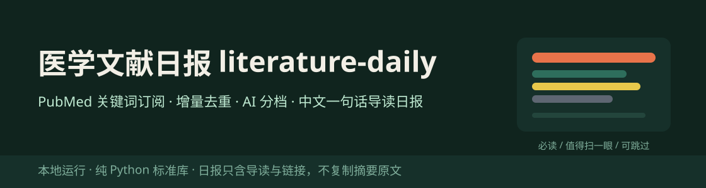
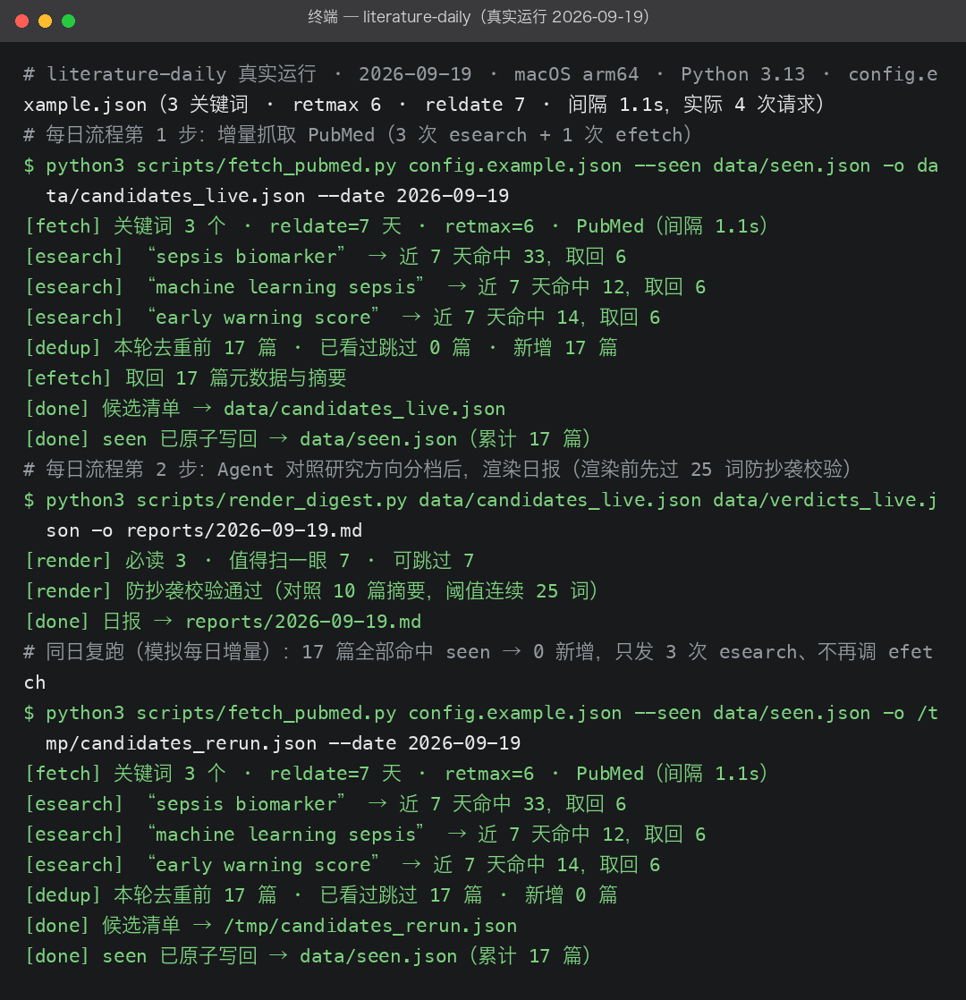
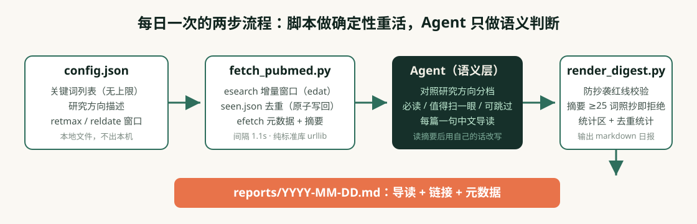

# 医学文献日报 literature-daily

  

医学科研文献日报：PubMed 关键词订阅、本地降噪排序，每天一份带中文一句话导读的文献日报。
把你的关键词和研究方向写进配置，每天跑一次：脚本增量抓取 PubMed 并去重，Agent 对照你的
方向把新文献分成"必读 / 值得扫一眼 / 可跳过"，每篇给一句中文导读。日报只含导读、链接与
元数据——不复制摘要原文，全部处理在本机完成。

## 使用场景

这个工具用在**每天/每周扫一遍本领域新文献**这件小事上：

| 场景 | 你是谁 | 什么时候用 | 日报帮你干什么 |
| --- | --- | --- | --- |
| 组会前扫新文献 | 科研研究生 | 组会前一天想快速过一遍本周新论文 | 必读 3–5 篇带导读和理由，扫一眼就知道哪篇值得精读，不用逐个点开 PubMed |
| 临床之余追进展 | 临床医生 / 住院医 | 值班间隙只有 5 分钟 | 可跳过档直接折叠，只看与自己亚专业相关的条目；导读标明研究设计与样本量 |
| 开题/综述持续跟踪 | 课题组成员 | 长期盯着几个方向等切入点的窗口期 | 同一篇不会重复出现（本地 seen 去重），命中数与取回数对比帮你收窄关键词 |

不适合的场景：系统综述的全面检索（那需要完整的检索式策略与去重登记）、全文获取、
影响因子过滤——它只做"订阅 → 降噪 → 导读"这一段。

## 它解决什么问题

PubMed 每天新增数千篇：2026-09-19 实测 `journal article` 类型最近 1 天入库 7,773 篇，
靠人肉刷不现实。付费工具 [Stork 文献鸟](https://www.storkapp.me/)验证了需求——全套餐
挂牌约 ¥8,998/年（促销 ¥3,699–3,999），且 AI"文献导读"是付费功能；免费的 My NCBI
邮件推送只给原始命中列表，没有相关性排序、没有中文导读、同一篇命中多个订阅会重复收。
这三件事（语义降噪、中文导读、跨关键词去重）正是本仓库的全部工作。

一个常见误传顺带澄清：所谓"50 个关键词上限"是 **Stork 免费档**的限制，不是 My NCBI
的——本仓库的关键词数量没有任何上限，只受你愿意投入的阅读时间约束。

  

上图是本仓库当前版本在本机的**真实运行**（2026-09-19，3 个脓毒症方向关键词、
retmax 6、请求间隔 1.1s，全程 4 次请求）：三个关键词各命中 33/12/14 篇，去重后 17 篇
新文献；Agent 分档 3 必读 / 7 值得扫一眼 / 7 可跳过；同日复跑 17 篇全部命中 seen、
0 新增、不再调 efetch。逐字记录见 [live_transcript.txt](evals/runs_v1/live_transcript.txt)。

日报长这样（真实产物 [live_digest_2026-09-19.md](evals/runs_v1/live_digest_2026-09-19.md) 节选）：

> **🔴 必读 · 1.** Dynamic Changes of Neutrophil Nuclear Membrane CD63…（[PMID 42756472](https://pubmed.ncbi.nlm.nih.gov/42756472/)）
> MedComm (2020) · 2026 Oct · DOI: 10.1002/mco2.71007
> **导读**：中性粒细胞核膜 CD63（nmCD63）流式检测在两中心前瞻队列（含独立外部验证）中可早于常规指标提示脓毒症并评估预后。
> **理由**：正中研究方向核心（机器学习预警）；带外部验证的前瞻设计，方法学可直接对照本课题方案。

  

## 能力与边界

| 能力 | 边界 |
| --- | --- |
| 增量抓取 + 本地去重：seen 原子写回，重复运行不重复出报 | 窗口按 Entrez 入库日期（edat），in-process 记录更新会让个别条目"重见"，由 seen 兜底 |
| Agent 相关性分档 + 中文一句话导读（自己的话，非翻译） | 导读是 AI 生成（model_only 自评质量），必须点开原文核实结论后再引用 |
| 防抄袭红线落地成代码：导读含摘要原文连续 ≥25 词片段即拒绝渲染 | 红线只挡"逐字照抄"，改写幅度的合理性仍靠人判断 |
| 纯 Python 标准库（urllib + xml.etree），无第三方依赖 | 无影响因子过滤、无邮件投递、无全文获取；超过 retmax 的命中被截断（日志明示命中数） |
| 对 NCBI 温柔：默认 1.1s 间隔（约 0.9 req/s），带 tool/email 标识 | 免费无 key 限速 3 req/s；不支持并发抓取，也不提供云端定时（定时请用本机 cron） |

## 如何安装与使用

把本仓库放入你的 Agent 技能目录，然后直接对 Agent 说：

> "这是我的研究方向和关键词，帮我出一份本周 PubMed 文献日报。"

Agent 会先给你一份关键词与研究方向配置确认，运行抓取脚本，读候选清单的摘要做分档，
写好每篇的中文一句话导读后渲染成日报文件。之后每天只需说"出今天的文献日报"，
已读过的文献不会重复出现。命令行参数、退出码与定时运行的说明见
[维护文档](docs/usage.md)（含 NCBI 免费 api_key 的建议用法）。

## 评测结果

V1 评测（2026-09-19，v0.1.0）：**8/8 用例通过，0 硬失败，27/27 单元测试通过**。
覆盖离线全管线、8 类 XML 解析边界（无 DOI、无摘要、作者后缀、集体作者、图书章节等）、
seen 去重原子写回、防抄袭红线（24 词放行 / 25 词拒绝）、渲染确定性（同输入两次
sha256 一致）、真实 PubMed 端到端、错误码与 Agent 分档质量九类行为。

  

- 逐题判断：[judgments_v1.jsonl](evals/judgments_v1.jsonl)；汇总：[summary_v1.json](evals/summary_v1.json)
- 真实产物与哈希：[evals/runs_v1/](evals/runs_v1/)

**2026-09-19 第二次联网回归（v0.1.1，11 次请求，间隔 1.1s）**：沿用首次真实运行写下的
seen 真实复抓——17 篇**全部命中 seen 去重、0 新增、不再调 efetch**；reldate=1/7/30 的
命中数 11→33→147 单调递增，edat 增量窗口真实生效；`journal article[pt]` 近 1 天命中
8,595（≥ 同日早间记载的 7,773，日增口径自洽）。顺带把渲染分组排序固定为"同档内按候选
清单顺序"、seen 写回收敛重复项，单元测试增至 **29 项**。逐字记录见
[live_transcript_v2.txt](evals/runs_v1/live_transcript_v2.txt)，结构化结论见
[live_regression2_2026-09-19.json](evals/runs_v1/live_regression2_2026-09-19.json)。

- **诚实披露**：README 首屏截图与日报节选来自 2026-09-19 的真实 PubMed 调用
  （入库产物已把摘要字段脱敏，避免转载出版方版权内容）；评测夹具全部为合成样本
  （PMID 99010001–99010006 为占位编号）。真实运行还暴露了一个真实缺陷——PubMed 图书
  章节（StatPearls 类）会让抓取中断，已修复并加入回归；过程见
  [迭代记录](evals/iteration_notes.md)。判定为开发 Agent 自评（model_only），
  分档质量尚未经医学信息学背景的人工复核。

## 对标与定位

与 Stork 文献鸟、My NCBI 邮件推送、Elicit、Readwise Reader、zotero-arxiv-daily
（5,962★，仅 arXiv）等工具的逐项对比，以及"50 关键词上限"误传的澄清，
见[对标文档](references/benchmarks.md)。

需求来源：医学与自媒体需求雷达对公开信号的调研（problem_key `literature-daily`，
同雷达仓库 medical-selfmedia-demand-radar 出品），痛点证据为 PubMed 日增数千篇的
实测数据与 Stork 已被 82 篇科研论文致谢引用的付费验证。

## 社区与许可

- 社区讨论：[LINUX DO](https://linux.do)
- 许可证：Apache License 2.0（见 [LICENSE](LICENSE)，PubMed 数据与合成夹具的版权说明见 [NOTICE](NOTICE)）
